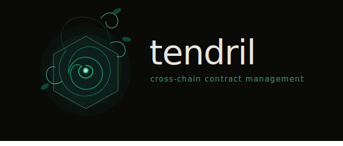

# Tendril



One wallet. Every chain. Same address.

Tendril gives you a single contract identity across every Ethereum L2. Plant a tendril to any chain and control it from your root wallet on L1 — no multisigs, no bridge UIs, no per-chain key management.

## Why

Managing contracts across L2s today means separate deployments, separate admin keys, and separate transactions on each chain. Tendril collapses that into one operation from one address:

- **Same address everywhere** — Deterministic CREATE2 deployment means your tendril lives at the same address on every chain
- **One root, full control** — Sign once on L1, execute on any L2 through native bridge messaging
- **Deploy contracts cross-chain** — Spin up upgradeable proxies on any chain from your root wallet
- **No trusted intermediaries** — Uses native L1-to-L2 bridges with address aliasing, not relayers or oracles

## How it works

A tendril contract is deployed to the same deterministic address on every chain via the [Arachnid CREATE2 deployer](https://github.com/Arachnid/deterministic-deployment-proxy). On the root chain (L1), the admin is your wallet. On L2s, the admin is the address-aliased tendril contract, so only cross-chain messages from the parent tendril are authorized.

When you execute a command, the CLI encodes your call, wraps it in the appropriate bridge message, and sends it from your root. The message flows through the bridge and executes on the target chain.

## Setup

```sh
bun i && forge install
cp .env.example .env
```

| Variable       | Description                                          |
| -------------- | ---------------------------------------------------- |
| `ROOT`         | Your root admin address                              |
| `ROOT_CHAIN`   | `sepolia` or `mainnet`                               |
| `PRIVATE_KEY`  | Private key for signing (optional if using keystore) |
| `ETH_KEYSTORE` | Foundry keystore name                                |

```sh
# Plant your first tendril
bun tendril plant sepolia
```

## CLI

```sh
bun tendril <command> [options]
```

### Global options

| Flag               | Description                               |
| ------------------ | ----------------------------------------- |
| `--root <address>` | Root admin address (overrides `ROOT` env) |
| `--mainnet`        | Use mainnet (default: sepolia)            |
| `--sim`            | Simulate without sending                  |
| `-v, --verbose`    | Detailed output                           |

### Commands

**`plant <chain>`** — Deploy a tendril to a new chain

```sh
bun tendril plant base-sepolia
bun tendril plant --direct base-sepolia   # deploy directly, not via root
bun tendril --mainnet plant base
```

**`addr`** — Show the tendril address for the current root

```sh
bun tendril addr
```

**`execute <chain> <to> <sig> [args...]`** — Execute a call through a tendril

```sh
bun tendril execute base-sepolia 0xAddr "transfer(address,uint256)" 0xTo 1000
bun tendril execute base-sepolia 0xAddr "deposit()" --value 0.1ether
bun tendril --sim execute base-sepolia 0xAddr "pause()"
```

**`deploy <chain> <impl>`** — Deploy an upgradeable proxy through a tendril

```sh
bun tendril deploy base-sepolia 0xImpl
bun tendril deploy base-sepolia 0xImpl --salt 0x01 --init "initialize(address)" --init-args 0xOwner
```

### Supported chains

| Chain            | Type |
| ---------------- | ---- |
| mainnet          | Root |
| sepolia          | Root |
| base             | OP   |
| base-sepolia     | OP   |
| optimism         | OP   |
| optimism-sepolia | OP   |
| arbitrum         | Arb  |
| arbitrum-sepolia | Arb  |
